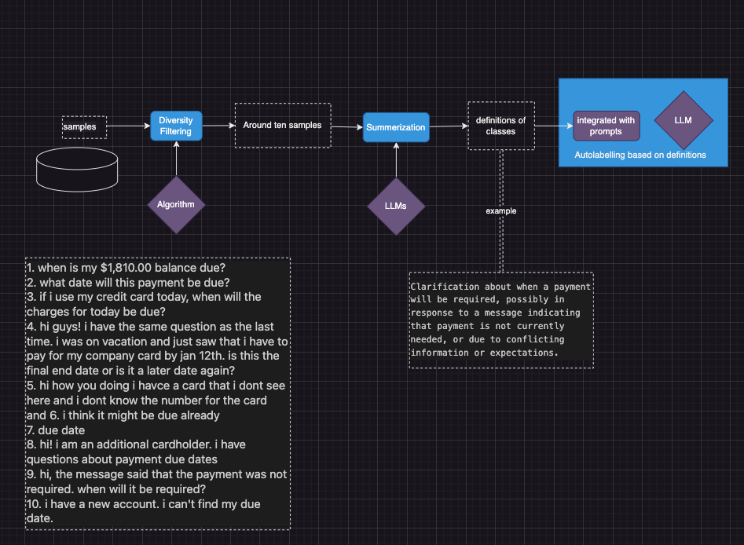

# llm_langchain_projects

llm_langchain_projects: Autolabelling, Search and Indexing

## Auto labelling Pipeline

#### outline of steps

+ step 1. Gather samples with same label. As many as possible.
+ Step 2. Using Diversity Filtering algorithm to reduce the size to around 5-20, while keep the diversity and comprehensivity
  + Step 1 and Step 2: Run `generate_label2samples` in `auto_labelling/embedding.ipynb` to gain diversified samples.
+ Step 3. Apply designed prompt and LLMs to summerize definition or generate labelling guildes from samples in step 2
  + Select prompts from `prompts_labelling` to generate definitions
+ Step 4. Integrate definitions and guides with prompts, schema, applying LLM to do auto labelling
  + Adjust your schema and input your api keys in `lc_tags_schema.py` to apply auto labelling.

